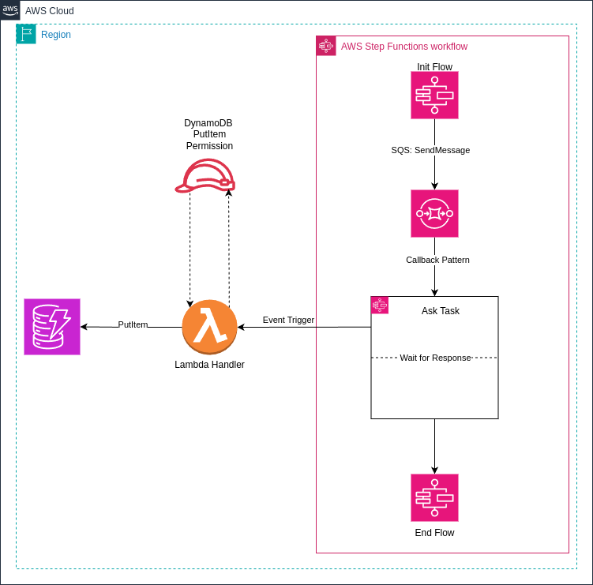
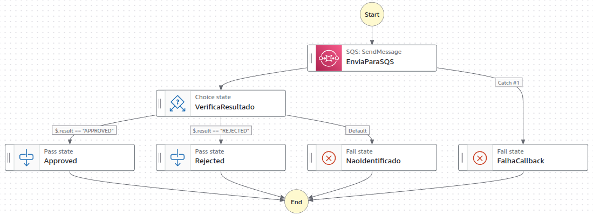

# Step Functions com Callback Pattern e DynamoDB

Este projeto implementa uma solução usando **AWS Step Functions**, **SQS**, **Lambda** e **DynamoDB**. O fluxo consiste em:

1. **Step Functions** envia uma mensagem para o **SQS** com detalhes da execução.
2. Uma **Lambda** consome a mensagem do SQS e salva os dados no **DynamoDB**.
3. Uma aplicação externa (no EC2) consulta o DynamoDB e envia o `taskToken` de volta para a Step Functions.

---
## Diagrama


## **Arquitetura da Solução**

### **Policy**
```json
{
  "Version": "2012-10-17",
  "Statement": [
    {
      "Effect": "Allow",
      "Action": [
        "sqs:ReceiveMessage",
        "sqs:DeleteMessage",
        "sqs:GetQueueAttributes"
      ],
      "Resource": "arn:aws:sqs:us-east-1:AccountID:MyQueueName"
    },
    {
      "Effect": "Allow",
      "Action": [
        "dynamodb:PutItem"
      ],
      "Resource": "arn:aws:dynamodb:us-east-1:AccountID:table/MyTableName"
    },
    {
      "Effect": "Allow",
      "Action": [
        "states:SendTaskSuccess",
        "states:SendTaskFailure"
      ],
      "Resource": "*"
    }
  ]
}
```

### **Componentes**

1. **Step Functions**:
    - Orquestra o fluxo.
    - Envia mensagens para o SQS com `transactionId`, `taskToken`, `startTime` e `orderId`.
    - Aguarda o callback da Lambda.

2. **SQS**:
    - Armazena as mensagens enviadas pela Step Functions.
    - A Lambda consome as mensagens da fila.

3. **Lambda**:
    - Processa as mensagens do SQS.
    - Salva os dados no DynamoDB.

4. **DynamoDB**:
    - Armazena os registros processados pela Lambda.
    - Contém os seguintes atributos:
        - `orderId`: ID do pedido.
        - `startTime`: Data de início do fluxo.
        - `transactionId`: ID da execução da Step Functions.
        - `taskToken`: Token de callback.
        - `status`: Status do processamento.

5. **Aplicação no EC2**:
    - Expõe endpoints REST para consultar o DynamoDB e enviar o `taskToken` de volta para a Step Functions.

---

## **Step Functions**



### **Definição da State Machine**

```json
{
   "Comment": "Exemplo Step Functions com Callback Pattern e condicionais",
   "StartAt": "EnviaParaSQS",
   "States": {
      "EnviaParaSQS": {
         "Type": "Task",
         "Resource": "arn:aws:states:::sqs:sendMessage.waitForTaskToken",
         "Parameters": {
            "QueueUrl": "https://sqs.us-east-1.amazonaws.com/AccountID/QueueName",
            "MessageBody": {
               "executionId.$": "$$.Execution.Id",
               "taskToken.$": "$$.Task.Token",
               "executionStartTime.$": "$$.Execution.StartTime",
               "businessKey.$": "$.businessKey"
            }
         },
         "Next": "VerificaResultado",
         "Catch": [
            {
               "ErrorEquals": [
                  "States.TaskFailed"
               ],
               "Next": "FalhaCallback"
            }
         ],
         "TimeoutSeconds": 240
      },
      "VerificaResultado": {
         "Type": "Choice",
         "Choices": [
            {
               "Variable": "$.result",
               "StringEquals": "APPROVED",
               "Next": "Approved"
            },
            {
               "Variable": "$.result",
               "StringEquals": "REJECTED",
               "Next": "Rejected"
            }
         ],
         "Default": "NaoIdentificado"
      },
      "Approved": {
         "Type": "Pass",
         "Comment": "Trate aqui a lógica de sucesso APPROVED",
         "End": true
      },
      "Rejected": {
         "Type": "Pass",
         "Comment": "Trate aqui a lógica de REJECTED",
         "End": true
      },
      "NaoIdentificado": {
         "Type": "Fail",
         "Cause": "Retorno não identificado"
      },
      "FalhaCallback": {
         "Type": "Fail",
         "Cause": "Falha no callback (SendTaskFailure)"
      }
   }
}
```
